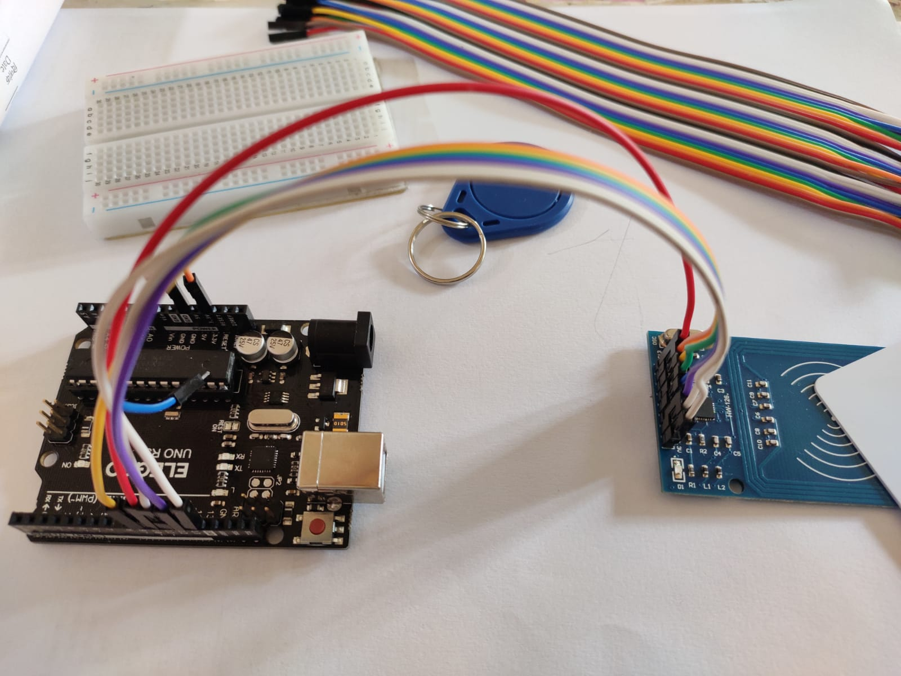

# RFID Attendance System
<h2>It is a RFID based Attendance System project</h2>
<h4>This project aims to design and develop an RFID-based attendance system that can streamline the attendance recording process, improve accuracy, and ensure compliance with the specific attendance policies of different organizations.</h4>

<h2>Code for the project: <a href='https://github.com/BeginnerCoder21/RFID_AttendanceSystem/blob/main/servo_lock.ino'>Link</a></h2>
<h2>Know more about the project: <a href='https://www.canva.com/design/DAFf-Cn_4vQ/lL9UMtDtZHD4RO4ujpirGg/edit?utm_content=DAFf-Cn_4vQ&utm_campaign=designshare&utm_medium=link2&utm_source=sharebutton'>Link</a></h2>

